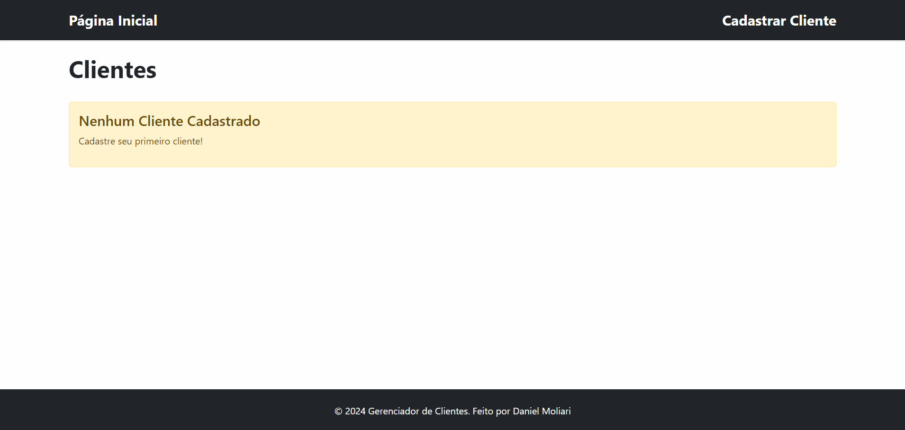

# Gerenciamento de Clientes



Esta aplicação é uma página de gerenciamento de clientes onde é possível adicionar, editar e excluir clientes. O projeto foi desenvolvido utilizando as tecnologias Laravel, MySQL, Inertia.js, Bootstrap e React.

### Link do sistema funcionando em um serviço de hospedagem:

https://gerenciador-clientes-daniel-ddcba2d51b3b.herokuapp.com/

#### Caso queira rodar a solução localmente, siga o tutorial abaixo:

## Tecnologias Utilizadas

-   Laravel (Backend)
-   MySQL (Banco de Dados)
-   Inertia.js (Integração Laravel + React)
-   React (Frontend)
-   Bootstrap (Estilização)

## Pré-requisitos

-   **Node.js** (versão 14+)
-   **Composer** (versão 2+)
-   **PHP** (versão 8.0+)
-   **MySQL** (ou MariaDB)
-   **Git** (para clonar o repositório)
-   **Servidor Local** (como Apache ou Nginx)

## Passo a Passo para Rodar a Solução

### 1. Clonar o Repositório

Clone o repositório do GitHub para o seu ambiente local com o SSH:

```bash
git clone --branch teste --single-branch git@github.com:DanielMoliari/gerenciador-clientes.git
cd gerenciador-clientes
```

ou com o HTTPS:

```bash
git clone --branch teste --single-branch https://github.com/DanielMoliari/gerenciador-clientes.git
cd gerenciador-clientes
```

### 2. Configurar o Backend (Laravel)

#### 2.1 Instalar Dependências do Laravel

No diretório do projeto, instale as dependências do Laravel usando o Composer:

```
composer install
```

#### 2.2 Configurar o .env

Crie um arquivo .env baseado no .env.example e configure as variáveis de ambiente, especialmente as de conexão com o banco de dados. No Windows, use o seguinte comando:

```bash
copy .env.example .env
```

No PowerShell, use:

```bash
Copy-Item .env.example -Destination .env
```

No Linux e no MacOS, use:

```bash
cp .env.example .env
```

Atualize as variáveis de banco de dados no .env:

```bash
DB_CONNECTION=mysql
DB_HOST=127.0.0.1
DB_PORT=3306
DB_DATABASE=seu_banco_de_dados
DB_USERNAME=seu_usuario
DB_PASSWORD=sua_senha
```

#### 2.3 Gerar a Chave da Aplicação

Gere a chave da aplicação Laravel:

```bash
php artisan key:generate
```

#### 2.4 Rodar as Migrações e Seeds

Execute as migrações para criar as tabelas no banco de dados:

```bash
php artisan migrate
```

Opcionalmente, você pode popular o banco com dados iniciais:

```bash
php artisan db:seed
```

#### 2.5 Iniciar o Servidor Local do Laravel

Inicie o servidor local do Laravel:

```bash
php artisan serve
```

### 3. Configurar o Frontend

#### 3.1 Instalar Dependências do Node.js

Instale as dependências do frontend utilizando o Yarn ou npm:

```bash
npm install
```

#### 3.2 Compilar os Assets

Compile os assets do frontend (CSS e JavaScript):

```bash
npm run dev
```

### 4. Testar a Aplicação

Após seguir todos os passos, a aplicação deve estar funcionando e acessível em seu navegador no endereço http://localhost:8000
